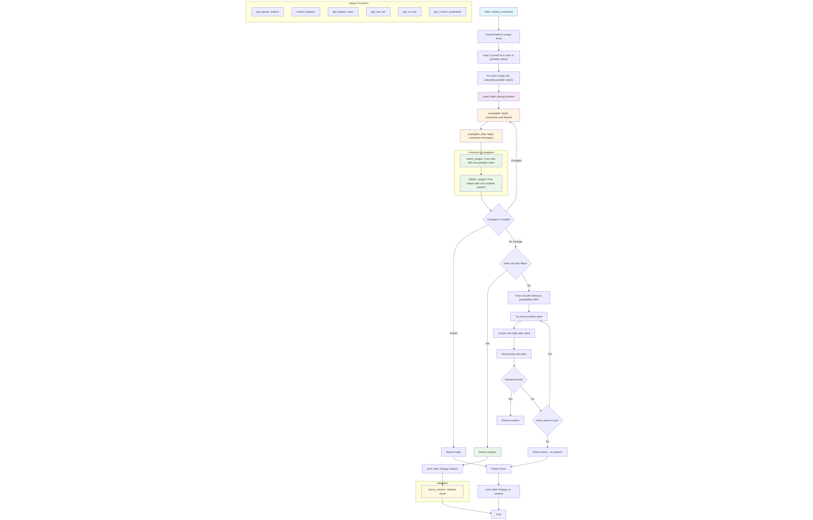

# Enhanced Sudoku solver

Base on the discussion on [stackoverflow](https://stackoverflow.com/questions/1697334/algorithm-for-solving-sudoku/79690713#79690713), and insipred by the intution of [domink](https://stackoverflow.com/users/214950/dominik), I tried to improve the algorithm.

First of all, I reduced the number of acceptable values for each cell, by removing all values in the same 3x3 square and in the same row and column for any given cell.

Then, in the `propagate_stare` function, I tried to optimize the search space.
**Key Components:**

1. **Initialization**: The solver starts by converting the input field to a numpy array and reading it into a state representation where empty cells (0s) become sets of possible values.

2. **Main Solving Loop**: The `solve` function uses a combination of constraint propagation and backtracking:
   - **Constraint Propagation**: Applies naked singles and hidden singles techniques repeatedly until no more changes occur
   - **Backtracking**: When propagation reaches a fixpoint, it uses the Minimum Remaining Values (MRV) heuristic to select the best cell to branch on

3. **Constraint Techniques**:
   - **Naked Singles**: Finds cells that have only one possible value
   - **Hidden Singles**: Finds digits that can only be placed in one position within a row, column, or 3x3 box

4. **Validation**: The solution is checked to ensure each row, column, and 3x3 square contains all digits 1-9 exactly once.

Flowchart:

The solution provided by *domink* has a bug, since it updates a mutable structure inside a loop with unpredicatble results. This one seems to provide a valid and much faster result.

Comparing the enhanced solution with a standard backtrcking algorithm, we achieve a 23X speed gain over the most difficult Sudoku:

    [
        [8, 0, 0, 0, 0, 0, 0, 0, 0],
        [0, 0, 3, 6, 0, 0, 0, 0, 0],
        [0, 7, 0, 0, 9, 0, 2, 0, 0],
        [0, 5, 0, 0, 0, 7, 0, 0, 0],
        [0, 0, 0, 0, 4, 5, 7, 0, 0],
        [0, 0, 0, 1, 0, 0, 0, 3, 0],
        [0, 0, 1, 0, 0, 0, 0, 6, 8],
        [0, 0, 8, 5, 0, 0, 0, 1, 0],
        [0, 9, 0, 0, 0, 0, 4, 0, 0]
    ]

    For 1 iterations, with a fill factor of 25.9%:
    - the enhanced version took 0.25156 seconds.
    - the tandard version took 5.69970 seconds.
    The enhanced version is 22.66 times faster.
    The output is the same for standard version and enhanced versions.
    The solution is valid.
    8 1 2 | 7 5 3 | 6 4 9
    9 4 3 | 6 8 2 | 1 7 5
    6 7 5 | 4 9 1 | 2 8 3
    - - - + - - - + - - -
    1 5 4 | 2 3 7 | 8 9 6
    3 6 9 | 8 4 5 | 7 2 1
    2 8 7 | 1 6 9 | 5 3 4
    - - - + - - - + - - -
    5 2 1 | 9 7 4 | 3 6 8
    4 3 8 | 5 2 6 | 9 1 7
    7 9 6 | 3 1 8 | 4 5 2
    ❯ 
The fill factor is the percentage of pre-filled cells over the total number of cells. The higher the value, the easier should be the puzzle.

With an eaiser starting grid, the gain is less imprssive, but still faster:

    [[5,1,7,6,0,0,0,3,4],
    [2,8,9,0,0,4,0,0,0],
    [3,4,6,2,0,5,0,9,0],
    [6,0,2,0,0,0,0,1,0],
    [0,3,8,0,0,6,0,4,7],
    [0,0,0,0,0,0,0,0,0],
    [0,9,0,0,0,0,0,7,8],
    [7,0,3,4,0,0,5,6,0],
    [0,0,0,0,0,0,0,0,0]]

    For 1 iterations, with a fill factor of 39.5%:
    - the enhanced version took 0.02826 seconds.
    - the tandard version took 0.04967 seconds.
    The enhanced version is 1.76 times faster.
    The output is the same for standard version and enhanced versions.
    The solution is valid.
    5 1 7 | 6 9 8 | 2 3 4
    2 8 9 | 1 3 4 | 7 5 6
    3 4 6 | 2 7 5 | 8 9 1
    - - - + - - - + - - -
    6 7 2 | 8 4 9 | 3 1 5
    1 3 8 | 5 2 6 | 9 4 7
    9 5 4 | 7 1 3 | 6 8 2
    - - - + - - - + - - -
    4 9 5 | 3 6 2 | 1 7 8
    7 2 3 | 4 8 1 | 5 6 9
    8 6 1 | 9 5 7 | 4 2 3